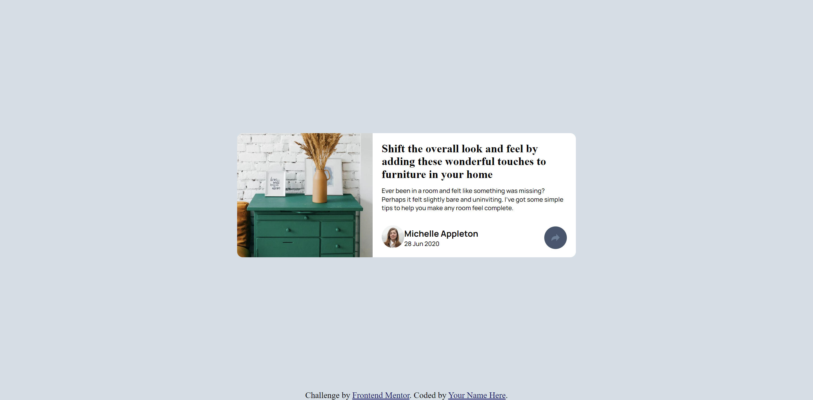

# Frontend Mentor - Article preview component solution

This is a solution to the [Article preview component challenge on Frontend Mentor](https://www.frontendmentor.io/challenges/article-preview-component-dYBN_pYFT). Frontend Mentor challenges help you improve your coding skills by building realistic projects. 

## Table of contents

- [Overview](#overview)
  - [The challenge](#the-challenge)
  - [Screenshot](#screenshot)
  - [Links](#links)
- [My process](#my-process)
  - [Built with](#built-with)
  - [What I learned](#what-i-learned)
  - [Continued development](#continued-development)
  - [Useful resources](#useful-resources)
- [Author](#author)
- [Acknowledgments](#acknowledgments)

## Overview

### The challenge

Users should be able to:

- View the optimal layout for the component depending on their device's screen size
- See the social media share links when they click the share icon

### Screenshot

.png)
.png)


### Links

- Solution URL: [get solution](https://github.com/CHARLIEADITYA/article-preview-component-master.git)
- Live Site URL: [view](https://charlieaditya.github.io/article-preview-component-master/)

## My process

### Built with

- Semantic HTML5 markup
- CSS custom properties
- Flexbox
- [Styled Components](https://styled-components.com/) - For styles

### What I learned
Here I learn how to hide or show our messages and 

To see how you can add code snippets, see below:

```html

```
```css
.hide {
    display: none;
}
```
```js
document.querySelector(".share").addEventListener("click", () => {
  document.querySelector(".share_btns").classList.toggle("hide");
  if (document.querySelector(".share_btns").classList.contains("hide")) {
    document.querySelector(".svg").style.color = "#6E8098";
  } else {
    document.querySelector(".svg").style.color = "white";
  }
});
```
## Author

- Github - [CHARLIEADITYA](https://github.com/CHARLIEADITYA)
- Frontend Mentor - [@CHARLIEADITYA](https://www.frontendmentor.io/profile/CHARLIEADITYA)
- Linkedib - [@adityabaranwal34](https://www.linkedin.com/in/adityabaranwal34/)

